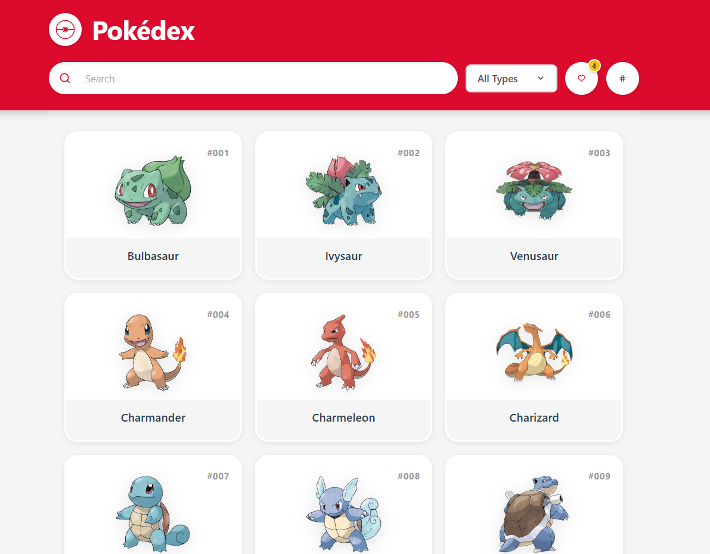
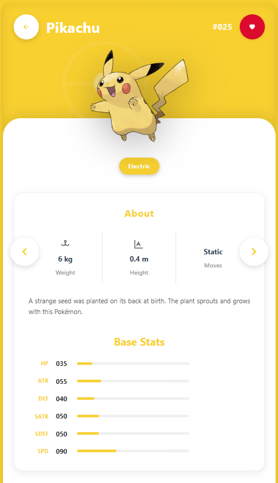

# 🎮 Pokédex App - Prueba Técnica Tita Media

Aplicación web moderna de Pokédex construida como una Single Page Application (SPA). Utiliza **React**, **TypeScript** y **Vite**, consumiendo la **PokeAPI GraphQL** para una gestión de datos eficiente, modular y con código de alta calidad.


## 🔗 Demo en Vivo

🚀 **[Ver Aplicación Desplegada](https://precious-empanada-59452a.netlify.app)**

---

## ✨ Características y Requisitos Cumplidos

Se implementaron todas las funcionalidades solicitadas en la prueba técnica, enfocándose en la eficiencia y la experiencia de usuario.

| Requisito | Característica Implementada | Descripción de la Solución |
| :--- | :--- | :--- |
| **Consumo GraphQL** | **Apollo Client** | Implementación de queries y caché para la lista y detalles de Pokémon (requisito valorado). |
| **Lista de Pokémon** | Lista + Ordenamiento | Muestra los 151 Pokémon, ordenados **alfabéticamente por nombre** (con opción a ordenar por número). |
| **Validación de Datos** | Búsqueda Flexible | El campo de búsqueda acepta **letras y números**, permitiendo buscar por **nombre o número** de Pokémon (cumpliendo el requisito de validación). |
| **Interacción** | Detalles del Pokémon | Navegación a una vista detallada con imagen, tipos, **número de generación**, peso, altura y estadísticas base. |
| **Interacción** | Agregar a Favoritos | Botón para guardar Pokémon en `localStorage` usando Context API. |
| **Mockup** | Filtrar por Tipo | Opción para filtrar la lista principal por cualquiera de los **18 tipos** de Pokémon. |

---

## 🏗️ Arquitectura y Stack Tecnológico

La arquitectura del proyecto está diseñada para ser escalable, mantenible y testeable, siguiendo las recomendaciones de la prueba.

### 📚 Stack Principal

* **Framework:** **React (v19.1.1)** - Uso de **Hooks** modernos y **Context API** para gestión de estado.
* **Lenguaje:** **TypeScript (v5.9.3)** - Tipado estricto (`--noImplicitAny`) para robustez.
* **Gestión de Datos:** **Apollo Client (v4.0.7)** - Cliente GQL para el consumo eficiente de la [PokeAPI](https://graphql-pokeapi.graphcdn.app/).
* **Enrutamiento:** **React Router DOM (v7.9.4)** - Gestión de rutas en la SPA.
* **Estilos:** **Pure CSS (CSS Modules)** - **Sin frameworks de CSS** (cumpliendo requisito explícito).
* **Build Tool:** **Vite (v7.1.11)** - Servidor de desarrollo y *build* de alta velocidad.
* **Testing:** **Vitest** y **React Testing Library** - Para pruebas unitarias y de integración.

### 💎 Principios de Diseño

* **Modularidad (Atomic Design):** Estructura organizada en `atoms`, `molecules`, `organisms`, `templates` y `pages` (siguiendo recomendación).
* **Lógica Separada:** La lógica de negocio y fetching de datos se encapsula en **Custom Hooks** (ej. `usePokemons`, `usePokemonDetails`, `useTypes`).
* **Gestión de Estado Global:** `FavoritesContext.tsx` maneja el estado de favoritos (con persistencia en `localStorage`) de forma desacoplada.

---

## 📁 Estructura del Proyecto

La estructura sigue una organización clara por responsabilidad, facilitando la navegación y el mantenimiento.

```bash
pokedex-app/
├── public/
└── src/
    ├── assets/       # Imágenes y fuentes
    ├── components/   # Atomic Design (atoms, molecules, organisms, templates)
    ├── context/      # FavoritesContext (Estado global y persistencia)
    ├── graphql/      # Cliente Apollo y queries GQL
    ├── hooks/        # Custom Hooks (usePokemons, useTypes, etc.)
    ├── pages/        # Vistas (HomePage, DetailsPage)
    ├── styles/       # Estilos globales y variables
    ├── types/        # Definiciones de TypeScript
    ├── utils/        # Funciones auxiliares y validación
    ├── App.tsx       # Enrutador principal
    └── main.tsx      # Punto de entrada de la aplicación
```

---

## 🚦 Instalación y Ejecución Local

### Requisitos Previos

- **Node.js** (v18 o superior)
- **npm**

### Pasos

```bash
# 1. Clonar el repositorio
git clone https://github.com/Danidiaz0799/pokedex-app.git
cd pokedex-app

# 2. Instalar dependencias
npm install

# 3. Ejecutar en modo desarrollo
npm run dev
# La aplicación estará disponible en http://localhost:5173

# --- Otros Comandos ---

# 4. Ejecutar la suite de tests
npm run test

# 5. Compilar para producción
npm run build
```

---

## 🧪 Pruebas y Calidad de Código

Para cumplir con la sugerencia de **Testeo**, el proyecto incluye una suite de **27 tests unitarios** para garantizar el correcto funcionamiento.

### Tecnologías

- **Vitest** y **React Testing Library**

### Cobertura

- Renderizado de componentes clave
- Interacciones de usuario (búsqueda, filtros, favoritos)
- Lógica de Custom Hooks
- Funciones de utilidad (especialmente validaciones de formulario)

### Estándares de Código

✅ TypeScript estricto con 100% de tipado  
✅ Código limpio, modular y organizado (Legibilidad y Organización)  
✅ Sin console.logs de depuración

---

## 🎨 Características de Diseño (UI/UX)

- **Diseño Responsivo (Mobile-First):** Interfaz completamente adaptativa a cualquier tamaño de pantalla
- **Tematización Dinámica:** En la vista de detalles, los colores de la interfaz (incluyendo el scrollbar) cambian para coincidir con el tipo principal del Pokémon
- **Micro-interacciones:** Animaciones suaves en hover, transiciones de carga y efectos en botones para una experiencia de usuario fluida

---

## 👨‍💻 Autor

**Daniel Steven Diaz**

Proyecto desarrollado como prueba técnica para **Tita Media** - Octubre 2025.